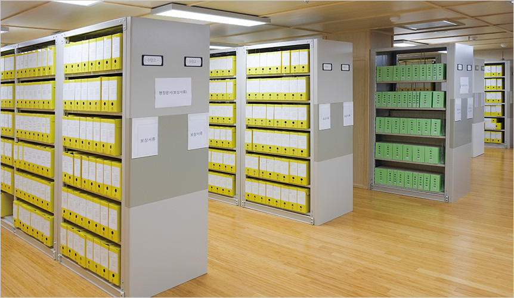

```{r setup, include=FALSE}
knitr::opts_chunk$set(echo = FALSE)
```


# 내가 기대하는 텍스트 분석


공공기록물의 평가에서 가장 핵심이 되는 것은 특정 업무에서 생산되는 기록물의 **보존가치**를 평가하는 것이다. 업무의 최하위 단계인 **단위과제**에 기록물의 업무 성격에 따라 분류하여 보존기간을 책정하는 것이다. 

텍스트 마이닝을 통해 기록물의 핵심 키워드를 도출하고, 이를 단위과제에 분류할 수 있다면 기록물 평가에 텍스트 분석이 상당한 기여를 할 수 있을 것으로 보인다. 따라서 이번 수업을 통해 공공기록물에 대한 평가 영역에서의 분석 방법을 알아간다면 유의미한 시간이 될 것으로 보인다.

<br>

```{r network, echo=FALSE, out.width = "55%", fig.align='center'}

```

